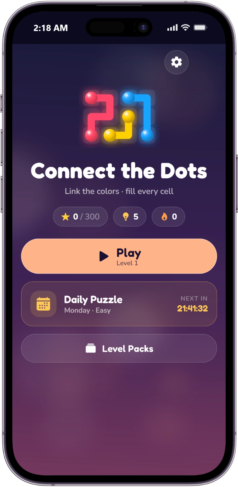
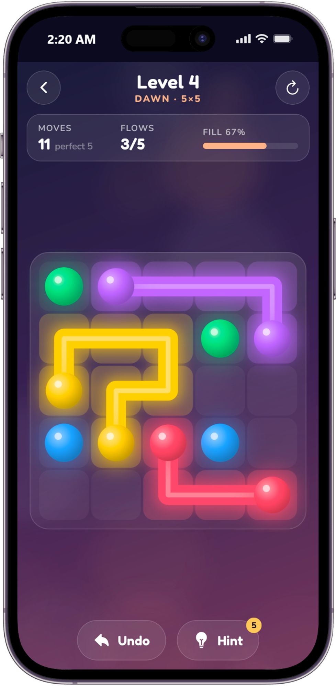
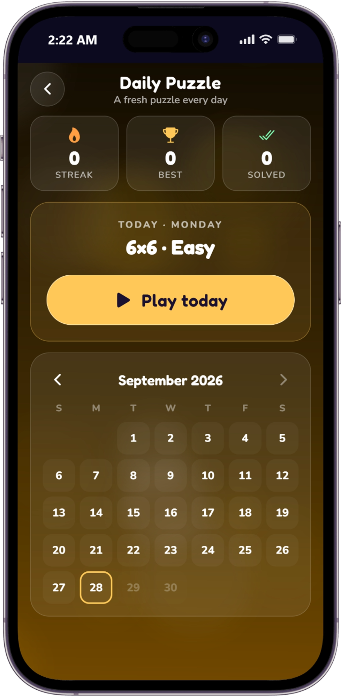

# Connect the Dots

A relaxing neon puzzle game for Android, iOS and the web. Connect matching colored dots with paths, never cross another path, and **fill every cell of the grid** to solve the level. Grids grow and new mechanics appear as you progress.

Built with Expo (React Native + React Native Web), Skia for the board, and Reanimated for animation. The full design is in [`PLAN.md`](PLAN.md).

## Screenshots

| Home | Game | Daily Puzzle |
| :---: | :---: | :---: |
|  |  |  |

## Features

- **100 handcrafted-by-generator levels** in 5 themed packs: Dawn, Lagoon, Ember, Aurora and Cosmos (5×5 up to 12×12).
- **Every level has exactly one solution**, verified by an exact solver.
- **New mechanics over time:** walls (blocked cells), bridges (two paths cross over each other) and warps (paths wrap around the edges).
- **Daily Puzzle** with a calendar, streak, best streak and solved count.
- **Star rating** (up to 3 stars per level) based on how close you get to the perfect move count.
- **Hints** that draw one correct path (earn more by getting ★★★), plus **Undo** and **Restart**.
- **Live HUD** showing moves, connected flows and fill percentage.
- **Soft Neon Night look:** glowing paths, glossy dots, glass UI and a different color theme for each pack.
- **Animations and effects:** path glow while drawing, pop when a flow connects, celebration burst and star reveal on level complete, animated ambient background.
- **Sound and haptics:** a musical note for each cell drawn, chimes on completion, ambient music per pack, vibration feedback on phones.
- **Accessibility:** colorblind mode (accessible palette + symbols on dots) and reduce-motion mode.
- **Progress saved on the device**, with an option to reset it.
- **Level generator CLI** that creates, rates and validates levels from a config file.

## Run the app

Requires [Node.js](https://nodejs.org/) 20+ and the [Expo Go](https://expo.dev/go) app on your phone (or an Android emulator).

```bash
# install everything once, from the repo root
npm install

# start the dev server
npm start
```

Then scan the QR code with Expo Go (Android) or the Camera app (iOS), or press `a` to open an Android emulator.

Run in a browser instead:

```bash
npm run web
```

> Run commands from the repo root with `npm …`, or run `npx expo …` inside `apps/mobile`. Running `npx expo start` in the repo root fails with `Unable to resolve "../../App"`.

### Other useful commands

```bash
npm test                 # run core game logic tests
npm run typecheck        # type-check all packages
npm run levels:build     # regenerate all 100 levels from tools/levelgen/levels.config.json
npm run levels:validate  # check every level is valid, solvable and has a unique solution
npm run export:web       # build the static web version into apps/mobile/dist
```

## Build an APK

### Option 1: Cloud build with EAS (easiest)

No Android Studio needed. You need a free [Expo account](https://expo.dev/signup).

```bash
npm install -g eas-cli
cd apps/mobile
eas login
eas build -p android --profile preview
```

When the build finishes, EAS prints a download link for the `.apk`. Open it on your phone to install. (`--profile production` builds an `.aab` for the Play Store instead.)

### Option 2: Local build

Requires JDK 17 and the Android SDK (`ANDROID_HOME` set), for example via Android Studio.

```bash
cd apps/mobile
npx expo prebuild -p android
cd android
./gradlew assembleRelease
```

The APK is written to `apps/mobile/android/app/build/outputs/apk/release/app-release.apk`. It is signed with the debug key, which is fine for sideloading and testing. For the Play Store, set up your own signing key first.

## Project structure

```
apps/mobile/        Expo app (screens, board rendering, audio, storage)
packages/core/      Game rules, solver and shared types
levels/             Level JSON files (pack-01 … pack-05) and daily puzzles
tools/levelgen/     Level generator and audio generator CLI
PLAN.md             Full game design and technical plan
```
